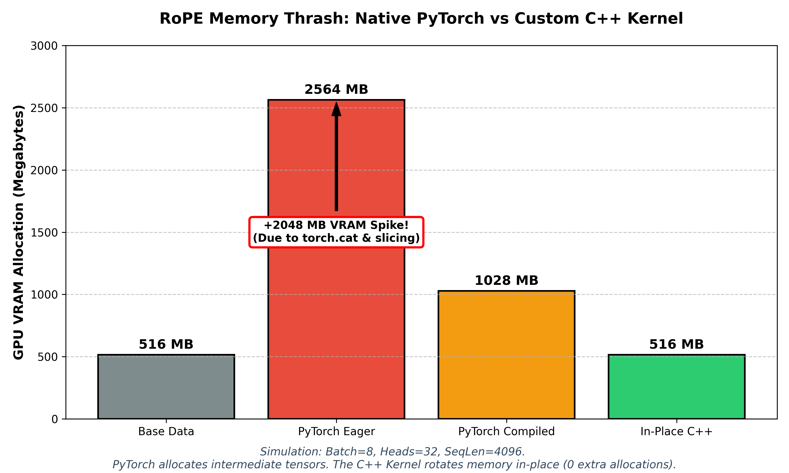

# 🌀 Pattern 08: Rotary Positional Embedding (RoPE) & Memory Thrash

> **Core Principle:** "In GenAI infrastructure, math is cheap but memory allocators are expensive. To scale LLMs, you must drop down to C++ to escape Python's immutable variable semantics."

## 1. The Architectural Intuition: The "Clock Face"
A Transformer processes entire sequences simultaneously. To the Attention mechanism, the sentence *"Dog bites man"* and *"Man bites dog"* look exactly the same—a concurrent bag of words. To fix this, we must inject a physical "timestamp" into every token.

**The Old Way (Absolute Embeddings):** The original 2017 Transformer added a hardcoded positional vector to each word. Think of it like a theater with exactly 4,096 painted seats. If you pass in 4,097 tokens, the model panics. It looks for "Seat 4097", realizes it doesn't exist in its lookup table, and crashes with an `IndexOutOfBounds` error.

**The Modern Way (Rotary Positional Embedding - RoPE):**
Instead of *adding* absolute seat numbers, RoPE uses trigonometry (Sine and Cosine waves) to mathematically **rotate** the Query (Q) and Key (K) vectors in complex space. 
* Imagine every word is an arrow pointing North. 
* Position 1 rotates the arrow 10 degrees. Position 2 rotates it 20 degrees. 
* When the Attention mechanism compares Token 1 and Token 2, it only looks at the **angle between them** (10 degrees). 

RoPE forces the model to learn **Relative Distance**. 

> **Insight:** Why do we only rotate Queries (Q) and Keys (K), but not Values (V)? 
> Think of Attention like a library. **Q** is your search query, **K** is the title on the spine of the book, and **V** is the text inside the book. Physical location only matters when trying to *find* the book (matching Q to K). Once you open it, the text inside (V) doesn't change meaning based on which shelf it was sitting on.

---

## 2. The 256K Context Trick: Position Interpolation
If RoPE is just a math formula ($\sin(\text{pos} \times \text{freq})$), what happens if you feed an 8,000-token document into a Llama model trained strictly on 4,096 tokens? 

**It doesn't crash, but it hallucinates.** Because RoPE isn't a lookup table, it happily calculates the rotation for Token 8,000 (e.g., rotating it 80,000 degrees). However, the neural network weights have *never seen an angle that steep*. This is an **Out-Of-Distribution (OOD)** signal. The model loses its mind and outputs gibberish.

**The Fix (Position Interpolation):** To extend a 4K model to 128K or 256K overnight, engineers "squish" the gears. By dividing the position index by a scale factor, we compress 256,000 tokens into the exact same rotational boundaries (0° to 40,000°) the model originally learned. The model thinks the words are just spaced closer together, allowing massive context windows without expensive retraining.

---

## 3. The Systems Reality: Memory-Bound vs. Compute-Bound
In Pattern 07, we optimized massive `cuBLAS` Matrix Multiplications. Those operations are **Compute-Bound** (limited by how fast the GPU can multiply).

RoPE is fundamentally different. It is an **Element-Wise** operation. The math is trivial, making it strictly **Memory-Bound**. The bottleneck is how fast PyTorch can read and write to the GPU's VRAM.

When you write the standard RoPE rotation in pure Python (the method used in standard HuggingFace implementations), it forces the GPU to allocate massive amounts of intermediate memory due to slicing and concatenating (`torch.cat`). 

---

## 4. The Benchmark: PyTorch vs. Compiler vs. C++
We benchmarked a standard LLM Attention Layer `[Batch=8, Heads=32, Seq=4096, Dim=128]` with a Base VRAM of `516.00 MB`.



Here is the terminal output from our custom memory profiler:

```text
[A] Native PyTorch (Training / Autograd ON):
    Time:      51.171 ms
    Spike:     +2048.00 MB (Saves intermediate tensors for Backprop)

[B] Native PyTorch (Inference / no_grad):
    Time:      47.686 ms
    Spike:     +2048.00 MB (Slicing and torch.cat still force allocations!)

[C] PyTorch Compiled (Inference / Triton):
    Time:      7.372 ms
    Spike:     +512.00 MB (Fast, but Python semantics still require a new output object)

[D] In-Place C++ Kernel (Inference):
    Time:      7.353 ms
    Spike:     +0.00 MB (Zero allocations. Raw pointer mutation!)
```

---

## 5. Systems Analysis: Why Python Fails at 0-Allocation
If the C++ kernel saves gigabytes of memory, why doesn't PyTorch just do that under the hood natively?

**1. General-Purpose APIs vs. Specific Kernels**
PyTorch operates eagerly. When it reads `torch.cat([-q2, q1])`, it instantly asks the C++ backend for a brand new memory block. It doesn't look ahead to realize it could do a staggered in-place swap. 

**2. The Limit of `torch.compile` (Python Semantics)**
PyTorch 2.0's compiler is incredible. It successfully fused the operations, dropping the execution time from `47ms` to `7ms`! So why did it still spike by `+512 MB`?
Because in Python, `return a + b` creates a **brand new object**. You explicitly asked the PyTorch compiler to return a new tensor. The tensor `Q` is exactly 512 MB. The absolute best the compiler can do is allocate 512 MB for the output. It cannot legally overwrite your original input tensor without breaking Python's immutable variable rules.

---

## 6. The Inference Engine Solution
To serve a 70B parameter model, you cannot afford a 500MB VRAM spike across 80 different Attention layers. It will result in an instant Out-Of-Memory (OOM) crash.

Production inference engines (vLLM, TensorRT-LLM, SGLang) drop down to C++ to bypass Python's immutability. By passing a raw memory pointer (`float* q`) to the CUDA kernel, the GPU threads read the original vector, apply the trigonometric rotation in the ultra-fast L1 SRAM, and **physically overwrite the exact same memory address**. 

*Zero new bytes allocated. Maximum hardware survival.*
