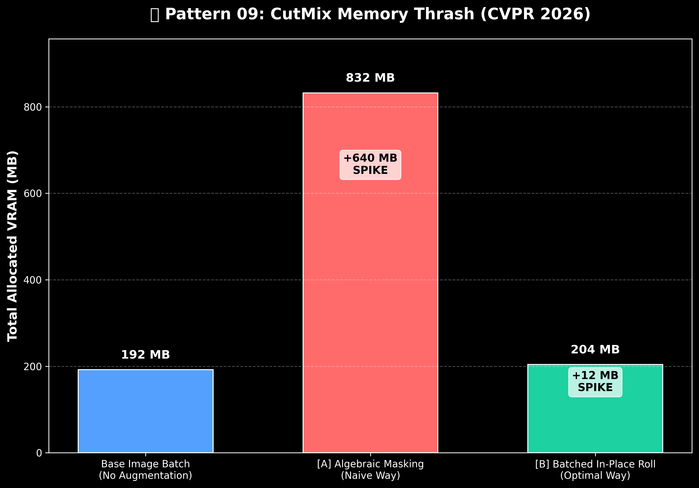
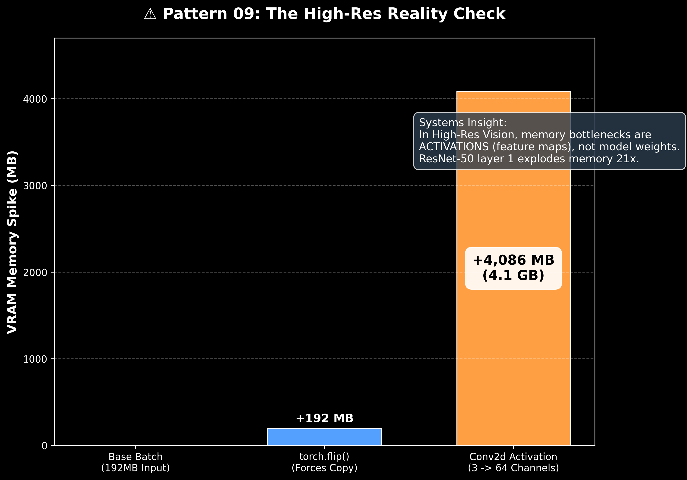
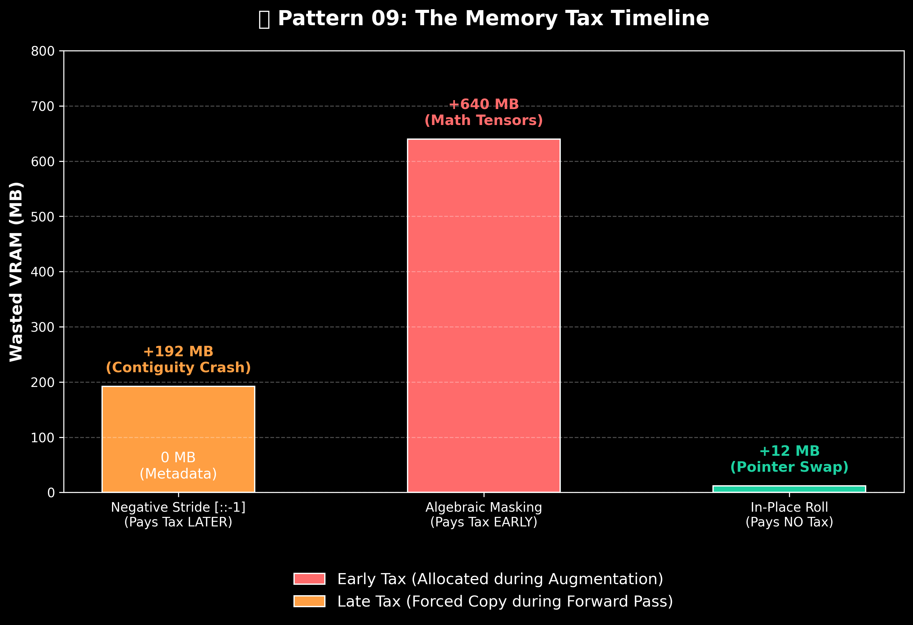

# 🖼️ Pattern 09: CV Augmentation Memory Traps & Contiguity

> **Core Principle:** "In high-resolution Computer Vision, the GPU bottleneck is rarely the math. The bottleneck is how your data pipeline moves, slices, and copies massive activation tensors across the memory bus."

## 1. The Engineering Challenge: GPU Starvation
When training Vision models (ResNet, YOLO, ViT) on high-resolution images (e.g., 1024x1024), standard augmentations like CutMix or Flips are usually done on the CPU using `torchvision` or `albumentations`. 

However, as GPUs get faster, the CPU data pipeline cannot keep up, causing **GPU Starvation** (the GPU sits idle at 20% utilization waiting for images). 
To fix this, engineers move augmentations directly to the GPU using PyTorch tensors. But if you execute these operations using standard "Pythonic" arrays, you will trigger massive, silent memory allocation spikes that can instantly crash a training run.

---

## 2. Trap #1: The CutMix Memory Thrash
**CutMix** (or Mosaic) is a state-of-the-art augmentation where you cut a patch from one image and paste it into another. It forces the network to learn global context rather than relying on a single dominant feature.

### The Naive Approach (Algebraic Masking)
Most developers implement this by creating a binary mask (1s and 0s) and using algebraic addition:
`new_batch = (batch * mask) + (batch[rolled] * (1 - mask))`

**The Hardware Reality:** PyTorch calculates the left side and allocates a massive intermediate tensor. It calculates the right side and allocates *another* massive tensor. Finally, it allocates a third tensor for the output. For a batch of 16 High-Res images, this spikes VRAM by **+640 MB**.

### The Optimal Systems Approach (Batched In-Place Roll)
Instead of doing math, we do memory surgery. We roll the indices of the batch and directly overwrite the original physical memory pointers:
`img_batch[:, :, y1:y2, x1:x2] = img_batch[rolled_indices, :, y1:y2, x1:x2]`

By doing an in-place pointer swap, we achieve the exact same CutMix augmentation with a **+12 MB** footprint. Zero math, zero intermediate tensors.

---

## 3. Trap #2: Negative Strides & The Contiguity Crash
If you want to horizontally flip a PyTorch tensor, the standard Python instinct is to use negative slicing: `img[::-1]`. 

If you try this in modern PyTorch, you will get a hard crash:
`ValueError: step must be greater than zero`

### Why did PyTorch ban negative strides?
If you bypass this rule and force a negative stride, the operation takes `0.00 MB` of memory. PyTorch simply changes the "Stride" metadata, telling the software to read the array backward. 

**However**, Convolution hardware kernels (like NVIDIA's cuDNN) are physically hardwired to read memory in a straight, forward-moving line (Coalesced Memory Access). They cannot run backward. 
Historically, when junior engineers passed negatively strided arrays into a `Conv2d` layer, the C++ backend would silently panic, halt the training loop, and force a massive `.contiguous()` memory copy to flip the pixels forward again. PyTorch eventually banned the syntax to stop developers from accidentally choking the memory bus.

If you use the official `torch.flip()` to bypass the error, PyTorch proactively fixes the contiguity by allocating a brand new **+192 MB** tensor upfront and physically copying the pixels.

---

## 4. The High-Res Reality Check (Activations > Weights)
The most dangerous realization in Computer Vision systems design is what happens immediately *after* your augmentations. 

When we passed our 16-image batch into a standard first-layer Convolution (`nn.Conv2d(3, 64)`), the VRAM spiked by **4,085 MB (4.1 Gigabytes)**.

### The Intuition: 
Early Convolution layers expand the "feature depth" of an image. We went from 3 RGB channels to 64 feature channels. 
* **Input Memory:** `16 x 3 x 1024 x 1024 x 4 bytes` = 192 MB
* **Output Memory:** `16 x 64 x 1024 x 1024 x 4 bytes` = 4,096 MB

When working with High-Res images, your VRAM bottleneck isn't the model's weights (a ResNet-50 is only ~100MB of weights). The true bottleneck is the massive **Activation Tensors** stored in the early layers for backpropagation. 

---

## 5. Real-World Industry Impact

* **State-of-the-Art Object Detection (YOLO Architectures):** The Mosaic and CutMix augmentations are the exact techniques that allowed the YOLOv4/YOLOv5 architectures to achieve real-time inference speeds while maintaining high Mean Average Precision (mAP) on small, occluded objects. 
* **The Occlusion Problem in ADAS:** In Advanced Driver Assistance Systems (ADAS), a neural network might learn to only recognize a "Pedestrian" if they are fully visible. By mixing patches of different images together via CutMix, engineers force the model to recognize a pedestrian even if only their top half is visible behind a parked car. Using the "Batched In-Place Roll" allows us to train these robust features on the GPU without exploding VRAM.
* **NVIDIA DALI:** The memory and CPU bottlenecks caused by naive augmentations (like the ones exposed in this benchmark) were so severe across the industry that NVIDIA built an entire dedicated C++ library called **DALI (Data Loading Library)** strictly to manage memory-contiguous, batched GPU augmentations without thrashing the VRAM bus.

---

## 6. The Production Pipeline Strategy (How to actually build it)

So, if algebraic CutMix wastes VRAM, and GPU Flips trigger contiguity crashes, how do we architect a high-performance vision pipeline? 

We split the work based on memory physics:

### Step 1: The CPU Dataloader (Metadata & Spatial Ops)
* **What to do here:** Horizontal Flips, Rotations, Color Jitter.
* **Why:** Libraries like `albumentations` or `torchvision.transforms` handle these operations efficiently on the CPU before the images are stacked into a batch. By flipping the image on the CPU, the memory is physically rearranged *before* it gets sent to the GPU. This completely avoids the `torch.flip()` 192MB contiguity crash in the VRAM.

### Step 2: The Device Transfer
* Move the perfectly contiguous, pre-flipped batch to the GPU: `batch = batch.cuda()`.

### Step 3: The GPU (Batched Memory Overwrites)
* **What to do here:** CutMix, Mosaic, Cutout.
* **Why:** These augmentations require blending multiple images in a batch together. Doing this on the CPU is incredibly slow. By doing it on the GPU using the **Batched In-Place Roll** (`batch[...] = batch[rolled]`), you achieve lightning-fast augmentations with a near-zero (+12MB) memory footprint, leaving all your VRAM available for the massive `Conv2d` forward pass.

---

### 🧠 Systems FAQ: When exactly do we pay the "Memory Tax"?

A common question is: *If negative strides (Flips) cause a massive VRAM spike during the Conv2d forward pass, why doesn't Algebraic Masking (CutMix) cause a spike during the forward pass too?*

It comes down to **when** PyTorch allocates the memory:
* **Negative Strides (Flips):** This is purely a metadata change. No new memory is allocated upfront. Because the physical memory is left untouched (and backward), the `Conv2d` C++ kernel panics and forces a memory copy **LATER** (during the forward pass).
* **Algebraic Masking (CutMix):** Mathematical operations (`A + B`) force PyTorch to allocate a brand new, physical tensor to hold the output. Because it builds a new tensor from scratch, it is automatically created contiguous. You pay a massive memory tax **EARLY** (during the augmentation step), but the forward pass is safe.
* **In-Place Roll (The Optimal Way):** By physically overwriting existing memory pointers, we create no new tensors (saving upfront memory) and we don't break the original memory contiguity (saving forward-pass memory). It is the only way to bypass the allocator entirely.

